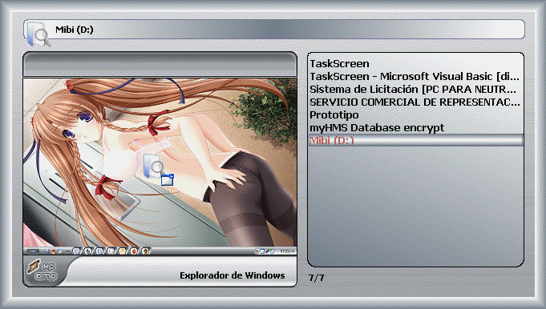



## TaskScreen XP 1\.0 \(Update 20 Feb\)

### Description

Update some controls.

TaskScreen XP is a good soluction for replace ALT-TAB Windows program, you can view a screenshot of any widnows in the taskbar.

Based on the program TaskSwitchXP Pro 2.0 by Alexander Avdonin.

This program is a begin but for me is a good start ^^, any comments are wellcome.

CREDITS/THANKS

John Underhill (Steppenwolfe)

Matthew R. Usner (BIG THANKS)

Luprix

Andrea Tincani

Khalid Pervaz

KPD-Team: http://www.allapi.net/

Ulli's

Richard Mewett

All the reserved rights &#169; 2007 HACKPRO TM
 
### More Info
 

             |
---                |---
**Submitted On**   |2007-02-17 19:30:30
**By**             |[Heriberto Mantilla Santamaria](https://github.com/Planet-Source-Code/PSCIndex/blob/master/ByAuthor/heriberto-mantilla-santamaria.md)
**Level**          |Intermediate
**User Rating**    |5.0 (45 globes from 9 users)
**Compatibility**  |VB 6\.0
**Category**       |[Complete Applications](https://github.com/Planet-Source-Code/PSCIndex/blob/master/ByCategory/complete-applications__1-27.md)
**World**          |[Visual Basic](https://github.com/Planet-Source-Code/PSCIndex/blob/master/ByWorld/visual-basic.md)
**Archive File**   |[TaskScreen2048942202007\.zip](https://github.com/Planet-Source-Code/heriberto-mantilla-santamaria-taskscreen-xp-1-0-update-20-feb__1-67775/archive/master.zip)

